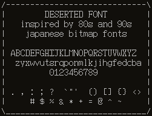

<p align=center>
  
</p>

```
building instructions:

1. ensure g++ or clang++ and make are installed
2. make
3. mkdir -p ~/.fonts
4. cp build/*.bdf ~/.fonts
5. fc-cache -fv

the font name used by fontconfig is "deserted" (which may or may not be case sensitive)
```
